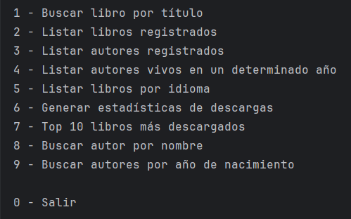
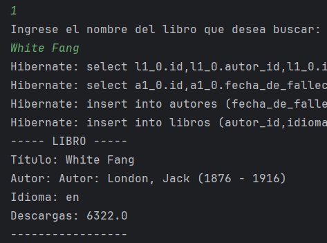
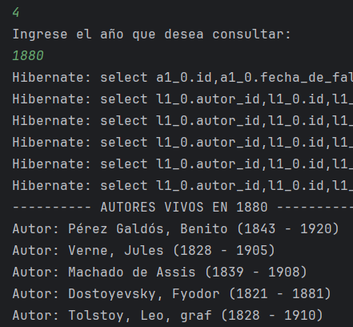
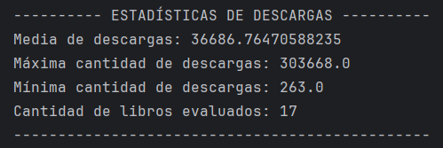
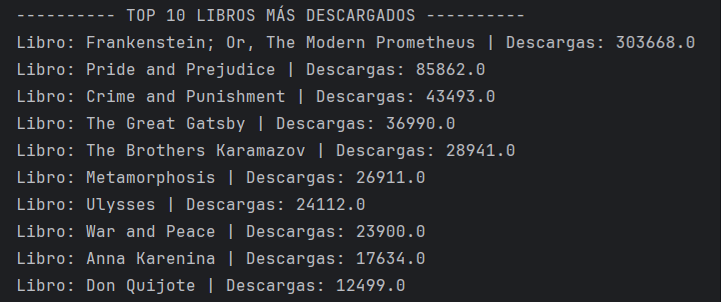
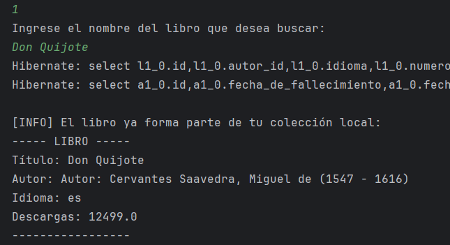
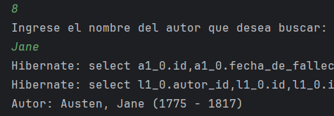
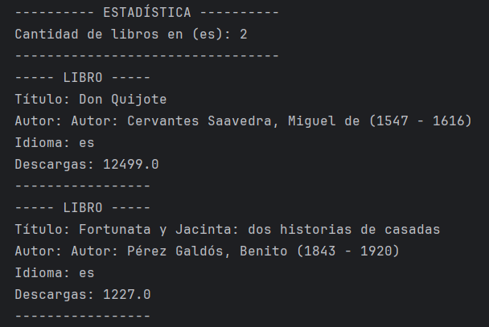
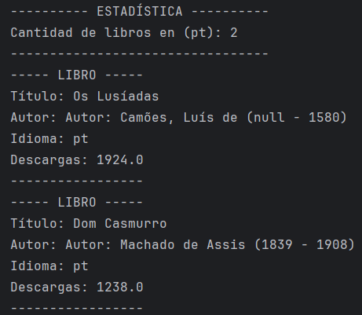
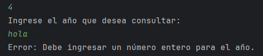

# 📚 LiterAlura - Infraestructura de Gestión Literaria

¡Bienvenido a **LiterAlura**! No es solo un buscador de libros; es una plataforma interactiva que consume la **API Gutendex**, procesa flujos de datos complejos y los transforma en una base de datos relacional robusta.

---

## 🚀 Desglose Detallado de Funcionalidades

Aquí es donde la lógica de negocio se encuentra con el usuario. Cada opción del menú ha sido diseñada para resolver una necesidad específica de información:

### 1. Motor de Búsqueda y Registro Inteligente
No es una simple descarga. Al buscar un libro por título:
* **Consumo de API:** Se realiza una petición asíncrona a Gutendex.
* **Mapeo de Datos:** El JSON se filtra para extraer título, idiomas y descargas.
* **Lógica de Autor Único:** El sistema verifica si el autor ya existe en la base de datos. Si existe, lo vincula; si no, lo crea. Esto evita la redundancia y mantiene la base de datos normalizada.

### 2. Inventario Bibliográfico (Listado General)
Muestra de forma organizada todos los libros que has decidido rescatar de la API. Incluye el título, el autor vinculado, el idioma principal y el impacto de la obra (número de descargas).

### 3. Directorio de Mentes Literarias (Autores)
Una vista dedicada exclusivamente a los autores. Aquí es donde se aprecia la **integridad referencial** del proyecto: cada autor aparece una sola vez, con sus fechas de vida, sin importar cuántos de sus libros hayas registrado.

### 4. Cronología de Vida: "Autores Vivos"
Esta es una de las funciones que más disfruté programar. Ingresas un año y el sistema realiza una consulta lógica para encontrar qué autores estaban vivos en ese momento exacto. Es una ventana al pasado que cruza datos biográficos con **precisión quirúrgica**.

### 5. Segmentación Lingüística
Filtra tu biblioteca por códigos internacionales (`es`, `en`, `fr`, `ru`, `pt`). Es fascinante ver cómo el sistema organiza obras en cirílico o francés con la misma eficiencia.

### 6. Laboratorio Estadístico
Aquí aplicamos el poder de **Java Streams**. El sistema analiza cada libro registrado y entrega métricas calculadas en tiempo real:
* **Promedio de descargas:** El nivel de popularidad medio de tu biblioteca.
* **Máximo y Mínimo:** Identificación de los extremos de interés del público.
* **Conteo total:** Cantidad exacta de registros procesados.

### 7. Ranking de Excelencia (Top 10)
Una consulta personalizada que ordena tu base de datos y te entrega las 10 joyas más descargadas de tu colección, permitiendo un análisis rápido de las tendencias de lectura.

### 8. Localización Específica de Autores
Búsqueda por nombre (o fragmentos) y por año de nacimiento. Ideal para cuando tienes un dato parcial y necesitas que el sistema complete el rompecabezas bibliográfico mediante consultas optimizadas en **JPA**.

---

## 🏗️ Arquitectura y Estructura Técnica

El proyecto sigue una estructura de capas limpia, lo que facilita su escalabilidad, mantenimiento y lectura:

```text
literalura/
├── src/main/java/com/aluracursos/literalura/
│   ├── model/           # Modelado de datos y transferencia
│   │   ├── Autor.java         → Entidad JPA
│   │   ├── Libro.java         → Entidad JPA
│   │   ├── Datos.java         → Wrapper principal del JSON
│   │   ├── DatosAutor.java    → DTO para datos de autores
│   │   └── DatosLibro.java    → DTO para datos de libros
│   ├── repository/      # Acceso a datos
│   │   ├── AutorRepository.java
│   │   └── LibroRepository.java
│   ├── service/         # Lógica de soporte y procesamiento
│   │   ├── ConsumoAPI.java      → Cliente HTTP
│   │   ├── ConvierteDatos.java  → Implementación de la conversión
│   │   └── IConvierteDatos.java → Interfaz genérica para Jackson
│   ├── principal/       # Interfaz de usuario
│   │   └── Principal.java       → Menú y flujo de control
│   └── LiteraluraApplication.java
└── src/main/resources/application.properties
```

## 🧠 Conceptos de Programación y Decisiones Técnicas

En este proyecto se consolidaron pilares fundamentales del desarrollo de software moderno, priorizando la escalabilidad, el rendimiento y la limpieza del código:

* **Optimización de Búsqueda Híbrida (UX/Performance):** Implementé una lógica de verificación inteligente que prioriza la base de datos local antes de realizar peticiones externas. Si el libro ya existe, el sistema lo recupera de **PostgreSQL** instantáneamente; de lo contrario, escala la búsqueda a la **API Gutendex**. Esto reduce la latencia y evita el consumo innecesario de recursos de red.
* **Programación Orientada a Objetos (POO):** Modelado de entidades con relaciones `@OneToMany` y `@ManyToOne` para reflejar con fidelidad la estructura de datos literarios y asegurar la integridad referencial.
* **Desacoplamiento mediante DTOs (Records):** Uso de **Java Records** (`Datos`, `DatosLibro`, `DatosAutor`) para procesar la respuesta de la API. Esta arquitectura garantiza la **inmutabilidad** y separa la estructura del JSON externo de nuestra lógica de negocio interna, facilitando el mantenimiento.
* **Arquitectura Genérica de Conversión:** Implementación de la interfaz `IConvierteDatos` con tipos genéricos (`<T>`), permitiendo que el motor de conversión basado en **Jackson** sea reutilizable para cualquier otro modelo de datos en el futuro.
* **Java Streams API:** Procesamiento declarativo y eficiente de colecciones para operaciones de filtrado, ordenamiento (Top 10) y generación de estadísticas descriptivas.
* **Manejo Robusto de Optional:** Gestión segura de la presencia o ausencia de datos mediante `Optional<T>`, eliminando el riesgo de errores de tipo `NullPointerException` durante las consultas.

---

## 🛡️ Configuración y Seguridad

Para proteger la infraestructura y seguir las mejores prácticas de desarrollo, el acceso a **PostgreSQL** se gestiona de forma segura. En el archivo `application.properties`, se utilizan descriptores que deben ser completados localmente mediante variables de entorno:

```properties
# Configuración Segura de Base de Datos
spring.datasource.url=jdbc:postgresql://${DB_HOST}:5432/${DB_NAME2}
spring.datasource.username=${DB_USER}
spring.datasource.password=${DB_PASSWORD}

# Hibernate / JPA
spring.jpa.hibernate.ddl-auto=update
spring.jpa.show-sql=true
```
> **Nota:** El uso de `${VARIABLES}` asegura que tus credenciales personales nunca sean expuestas en el repositorio público, manteniendo la integridad del proyecto.

## 🧑‍💻 El Sistema en Acción (Capturas)

Aquí es donde el código se convierte en realidad. He capturado estos momentos clave del sistema:

### 🖼️ Menú Principal

> Una interfaz de consola intuitiva y validada que guía al usuario en cada descubrimiento a través de sus 9 opciones principales.

### 🖼️ Registro de una Obra (Opción 1)

> **El proceso de transformación:** Se observa el flujo desde la recepción del JSON crudo de la API hasta la creación de objetos Java persistidos.

### 🖼️ Consulta de Autores Vivos (Opción 4)

> **Lógica cronológica:** La aplicación procesa rangos de fechas biográficas para devolver resultados históricamente coherentes según el año consultado.

### 🖼️ Estadísticas y Top 10 (Opciones 6 y 7)


> **Análisis de datos:** El poder de *Java Streams* aplicado para generar métricas descriptivas y rankings de popularidad en tiempo real.

### 🖼️ Validación de Duplicados e Integridad

> **Lógica de Integridad:** Se observa cómo el sistema identifica la existencia previa del autor o libro en **PostgreSQL**, evitando redundancias y optimizando el almacenamiento.

### 🖼️ Búsqueda por Nombre de Autor (Opción 8)

> **Flexibilidad de Consulta:** Demostración del método `findByNombreContainsIgnoreCase`, permitiendo localizar registros utilizando coincidencias parciales.

### 🖼️ Filtro por Idioma (Opción 5)


> **Soporte Multilingüe:** Visualización de obras filtradas por código internacional, demostrando la capacidad del sistema para gestionar diversos idiomas de forma eficiente.

### 🖼️ Gestión de Errores de Entrada

> **Resiliencia del Sistema:** Prueba de robustez donde el sistema captura excepciones de entrada inválida (Type Mismatch), informando al usuario sin interrumpir la ejecución.

---

## 👩‍💻 Autor

**Alan Rivera** 

